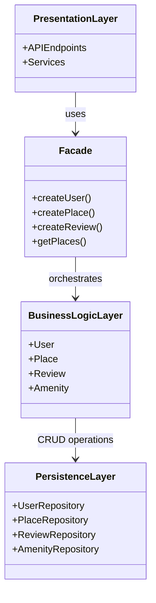
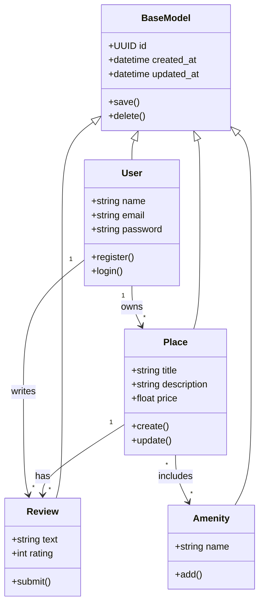
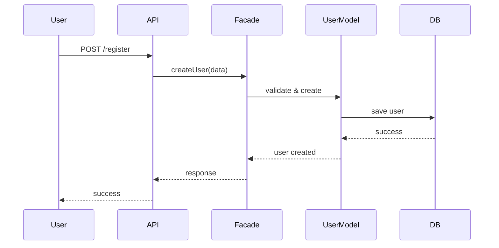
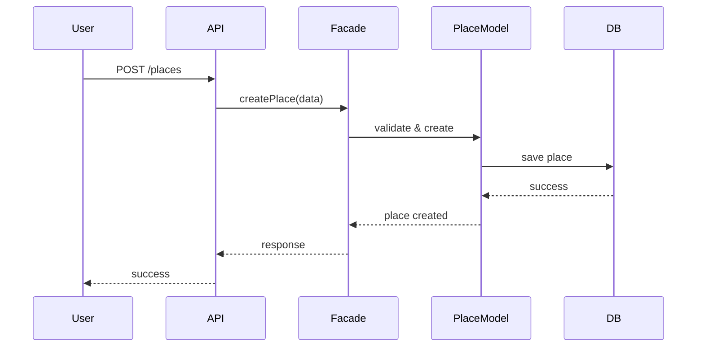
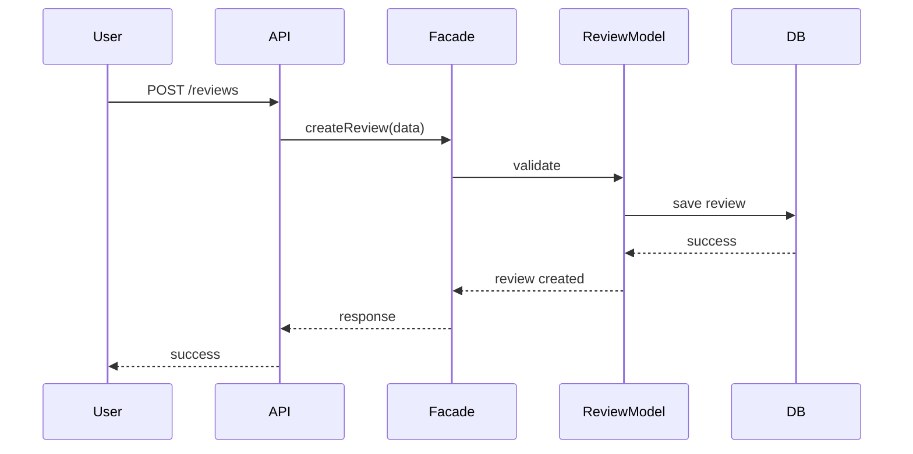
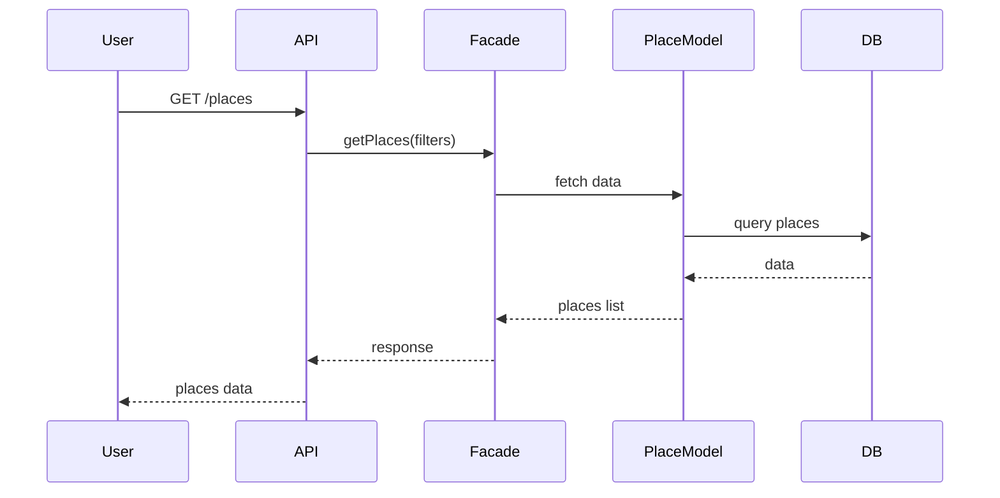

# holbertonschool-hbnb
## HBnB - System Architecture Documentation

## High-Level Package Diagram

### Explanation

Presentation Layer handles user interaction and API endpoints.
Business Logic Layer contains core models and business rules.
Persistence Layer manages database operations.
Facade Pattern provides a unified interface between Presentation and Business Logic layers.

---

## Business Logic Layer - Class Diagram

### Explanation

Each entity includes a unique identifier and timestamps via BaseModel.
User represents system users.
Place represents listings.
Review represents user feedback.
Amenity represents features of places.
Relationships define ownership, reviews, and associations between entities.

---

## Sequence Diagrams

### User Registration

---

### Place Creation

---

### Review Submission

---

### Fetch Places

